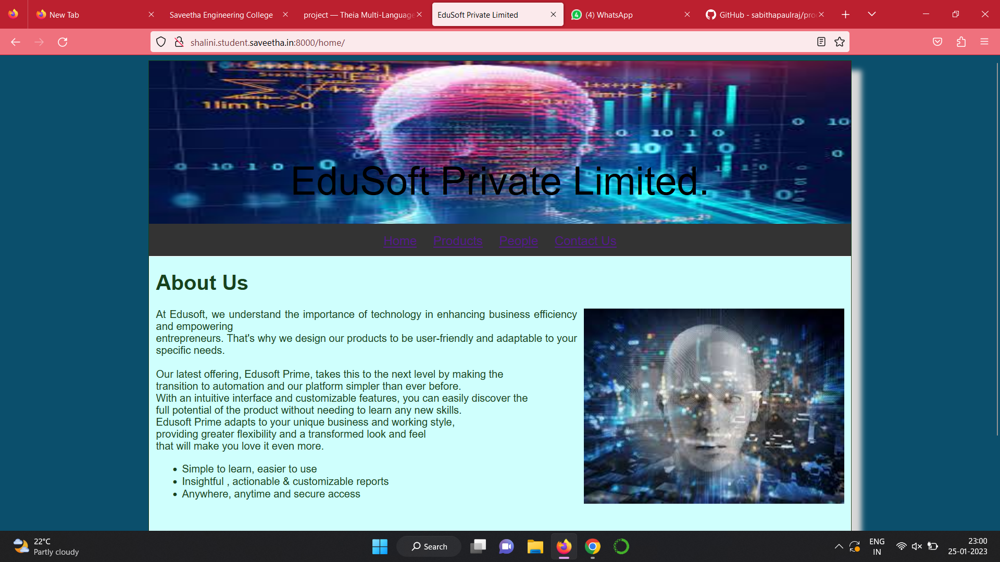
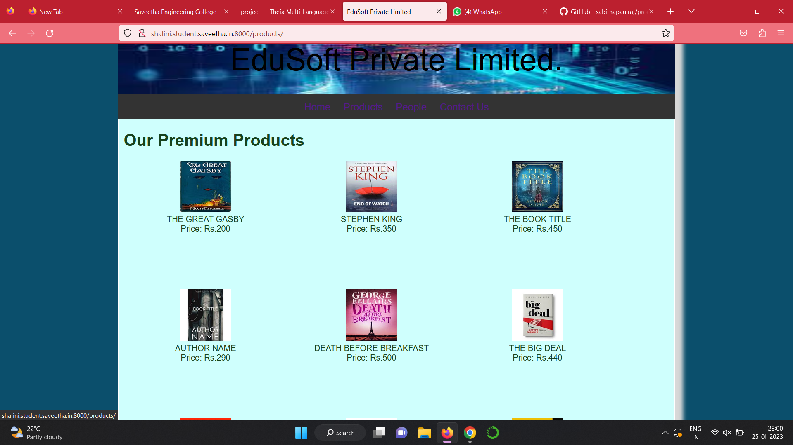
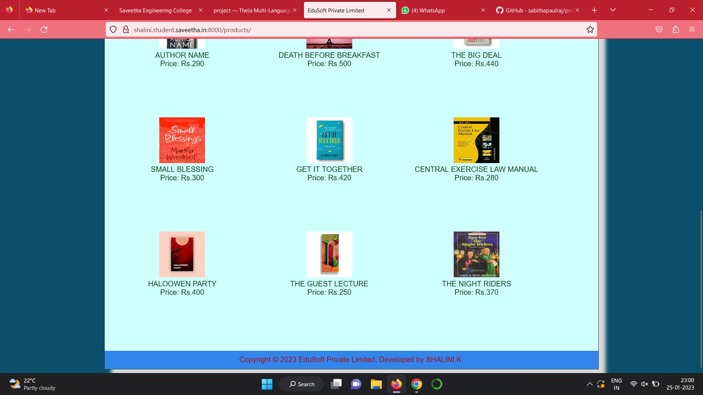
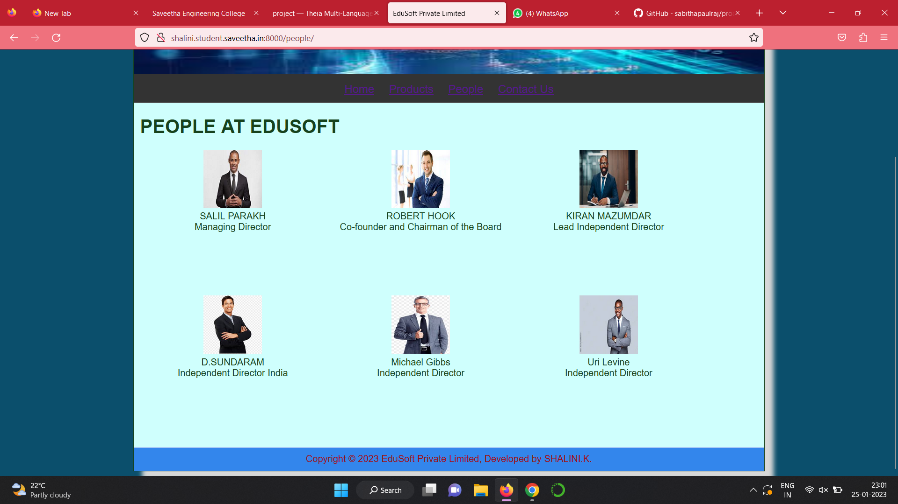
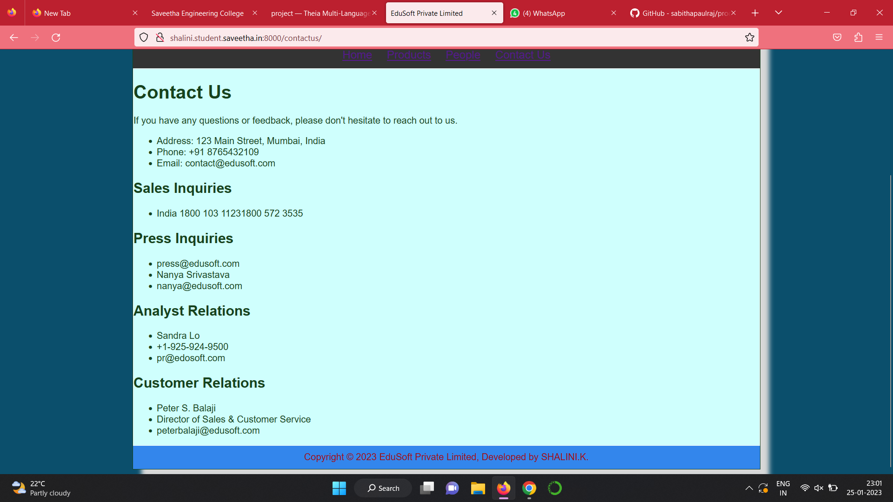
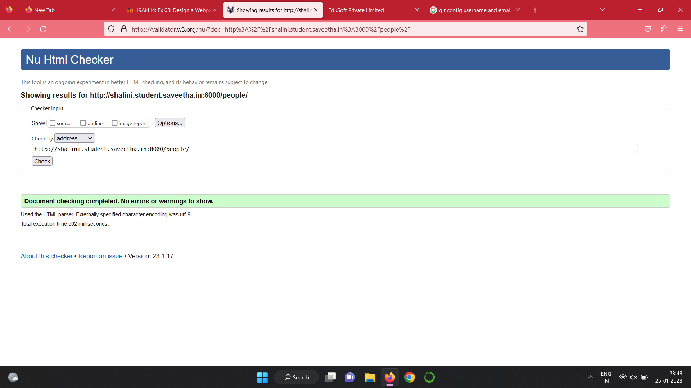

# Web Design for a Software Product Company

## AIM:

To design a static website for a software product company company.

## DESIGN STEPS:

### Step 1:

Requirement collection.

### Step 2:

Creating the layout using HTML and CSS.

### Step 3:

Updating the sample content.

### Step 4:

Choose the appropriate style and color scheme.

### Step 5:

Validate the layout in various browsers.

### Step 6:

Validate the HTML code.

### Step 6:

Publish the website in the given URL.

## PROGRAM :


COLOUR SCHEME
The color scheme of this CSS code includes a background color of #0B4F6C, text color of #17421d, banner text color of #F7CAC9, menu text color of #DCCCE3, selected menu text color of #F5FF98, and footer text color of #9c1018. The color scheme of this CSS code includes:

background color of dark blue
text color of dark green
banner text color of light pink
menu text color of light purple
selected menu text color of yellow
footer text color of dark red
Background Color and Text Color are COMPLEMENTARY.

PROGRAM :
```
LAYOUT .CSS

* {
  box-sizing: border-box;
  font-family: Arial, Helvetica, sans-serif;
}
body {
  background-color: rgb(80, 61, 21);
  color: black;
}
.container {
  width: 1080px;
  margin-left: auto;
  margin-right: auto;
  border-width: 1px 1px 1px 1px;
  border-style: solid;
  box-shadow: 15px 15px 8px #D8D8D8;
}

.banner {
  display: block;
  width: 100%;
  height: 250px;
  text-align: center;
  font-size: 60px;
  background-image: url("/static/banner.jpeg");
  background-size: 100% 100%;
  margin: 0px 0px 0px 0px;
  padding-top: 150px;
  color: #F7CAC9;
}

.menu {
  display: block;
  width: 100%;
  height: 50px;
  font-size: larger;
  background-color: rgb(10, 10, 51);
  text-align: center;
  padding-top: 15px;
  margin: 0px 0px 0px 0px;
  border-width: 1px;
}

.menuitem {
  display: inline-block;
  margin-left: 10px;
  margin-right: 10px;
}
.menuitemselected {
  display: inline-block;
  margin-left: 10px;
  margin-right: 10px;
  color: #F5FF98;
}

.menuitem a {
  text-decoration: none;
  color: #DCCCE3;
}

.content {
  display: block;
  width: 100%;
  background-color:whitesmoke;
  min-height: 500px;
  margin: 0px 0px 0px 0px;
  border-width: 1px;
  border-color: white;
  border-style: solid;
}
.homecontent {
  min-height: 500px;
  margin: 10px 10px 10px 10px;
}
.homecontent h1 {
  text-align: left;
}
.homecontent img {
  float: right;
  width: 400px;
  height: 300px;
  margin-left: 10px;
}

.contenttext {
  text-align: justify;
}

.productcontent {
  min-height: 500px;
  margin: 10px 10px 10px 10px;
}

.productcontent h1 {
  text-align: left;
}

.productitems {
  display: block;
}

.productitem {
  display: inline-block;
  width: 30%;
  height: 250px;
  text-align: center;
}

.productitem img {
  width: 100px;
  height: 100px;
  display: block;
}
.productitem .itemimage {
  display: block;
  margin-left: auto;
  margin-right: auto;
  width: 100px;
  margin-bottom: 5px;
}


.productitem .itemname {
  display: block;
}
.productitem .itemprice {
  display: block;
}

.footer {
  display: block;
  width: 100%;
  height: 40px;
  background-color:(rgb(10, 10, 51));
  text-align: center;
  padding-top: 10px;
  margin: 0px 0px 0px 0px;
  color: #d6da1c;
}

CONTACTUS.HTML


<!DOCTYPE html>
<html lang="en">
  <head>
    <title>EduSoft Private Limited</title>
   <link rel="stylesheet" href="/static/layout.css">
    <link rel="icon" href="/static/icon.png" type="image/x-icon">
     
  </head>

  <body>
    <div class="container">
      <div class="banner">EduSoft Private Limited.</div>
      <div class="menu">
        <div class="menuitemselected"><a href="/home/">Home</a></div>
        <div class="menuitemselected"><a href="/products/">Products</a></div>
        <div class="menuitemselected"><a href="/people/">People</a></div>
        <div class="menuitemselected"><a href="/contactus/">Contact Us</a></div>
      </div>
      <div class="content">
          
            <h1>Contact Us</h1>
  <p>If you have any questions or feedback, please don't hesitate to reach out to us.</p>
  <ul>
    <li>Address: 123 Main Street, Mumbai, India</li>
    <li>Phone: +91 8765432109</li>
    <li>Email: contact@edusoft.com</li></ul>
  
<h2> Sales Inquiries</h2>

<ul><li>India 1800 103 11231800 572 3535</li></ul>
    <h2>Press Inquiries</h2> 
<ul><li>press@edusoft.com</li>

<li>Nanya Srivastava</li>
<li>nanya@edusoft.com</li></ul>
    <h2>Analyst Relations</h2> 

    <ul><li>Sandra Lo</li>
    <li>+1-925-924-9500</li>
    <li>pr@edosoft.com</li></ul>
        <h2>Customer Relations</h2> 

    <ul><li>Peter S. Balaji</li>
    <li>Director of Sales & Customer Service</li>
    <li>peterbalaji@edusoft.com</li>
    </ul>
    
  </div>
   <div class="footer">
        Copyright &#169; 2023 EduSoft Private Limited, Developed by SHALINI.K.
      </div>
      </div>
</body>
</html>

PEOPLE.HTML

<!DOCTYPE html>
<html lang="en">
  <head>
    <title>EduSoft Private Limited</title>
    
     <link rel="stylesheet" href="/static/layout.css">
    <link rel="icon" href="/static/icon.png" type="image/x-icon">
    
  </head>

  <body>
    <div class="container">
      <div class="banner">EduSoft Private Limited.</div>
      <div class="menu">
        <div class="menuitemselected"><a href="/home/">Home</a></div>
        <div class="menuitemselected"><a href="/products/">Products</a></div>
        <div class="menuitemselected"><a href="/people/">People</a></div>
        <div class="menuitemselected"><a href="/contactus/">Contact Us</a></div>
      </div>
      <div class="content">
        <div class="productcontent">    
          <h1>PEOPLE AT EDUSOFT</h1>
          <div class="productitems">
              <div class="productitem"> 
                  <div class="itemimage">
                  
                  </div>
                  <div class="itemname">SALIL PARAKH</div>
                  <div class="itemprice">Managing Director </div>
              </div>
              <div class="productitem"> 
                  <div class="itemimage">
                  
                  </div>
                  <div class="itemname">ROBERT HOOK</div>
                  <div class="itemprice">Co-founder and Chairman of the Board </div>
              </div>
              <div class="productitem"> 
                  <div class="itemimage">
                  
                  </div>
                  <div class="itemname">KIRAN MAZUMDAR</div>
                  <div class="itemprice">Lead Independent Director </div>
              </div>
              <div class="productitem"> 
                  <div class="itemimage">
                  
                  </div>
                  <div class="itemname">D.SUNDARAM</div>
                  <div class="itemprice">Independent Director India </div>
              </div>
              <div class="productitem"> 
                  <div class="itemimage">
                  
                  </div>
                  <div class="itemname">Michael Gibbs</div>
                  <div class="itemprice">Independent Director </div>
              </div>
              <div class="productitem"> 
                  <div class="itemimage">
                  
                  </div>
                  <div class="itemname">Uri Levine</div>
                  <div class="itemprice">Independent Director </div>
              </div>
             
          </div>
          </div>        
      </div>
      <div class="footer">
        Copyright &#169; 2023 EduSoft Private Limited, Developed by SHALINI.K.
      </div>
    </div>
  </body>
</html>

HOME.HTML

<!DOCTYPE html>
<html lang="en">
  <head>
    <title>EduSoft Private Limited</title>
    
    
    <link rel="stylesheet" href="/static/layout.css">
    <link rel="icon" href="/static/icon.png" type="image/x-icon">
  </head>

  <body>
    <div class="container">
      <div class="banner">EduSoft Private Limited.</div>
      
      <div class="menu">
        <div class="menuitemselected"><a href="/home/">Home</a></div>
        <div class="menuitemselected"><a href="/products/">Products</a></div>
        <div class="menuitemselected"><a href="/people/">People</a></div>
        <div class="menuitemselected"><a href="/contactus/">Contact Us</a></div>
      </div>
      <div class="content">
        <div class="homecontent">
          <h1>About Us</h1>
          
          <div class="contenttext">
            At Edusoft, we understand the importance of technology in enhancing business efficiency and empowering <br>
            entrepreneurs. That's why we design our products to be user-friendly and adaptable to your specific needs.<br><br>
            Our latest offering, Edusoft Prime, takes this to the next level by making the <br>
            transition to automation and our platform simpler than ever before.<br>
            With an intuitive interface and customizable features, you can easily discover the <br>
            full potential of the product without needing to learn any new skills.<br>
            Edusoft Prime adapts to your unique business and working style,<br>
            providing greater flexibility and a transformed look and feel<br>
            that will make you love it even more.<br>


            <ul>
              <li>Simple to learn, easier to use</li>
              <li>Insightful , actionable & customizable reports</li>
              <li>Anywhere, anytime and secure access</li>
            </ul>
          </div>
        </div>
      </div>
      <div class="footer">
        Copyright &#169; 2023 EduSoft Private Limited, Developed by SHALINI.K
      </div>
    </div>
  </body>
</html>  

PRODUCTS.HTML

<!DOCTYPE html>
<html lang="en">
  <head>
    <title>EduSoft Private Limited</title>
     <link rel="stylesheet" href="/static/layout.css">
    <link rel="icon" href="/static/icon.png" type="image/x-icon">
    
  </head>

  <body>
    <div class="container">
      <div class="banner">EduSoft Private Limited.</div>
      <div class="menu">
     <div class="menuitemselected"><a href="/home/">Home</a></div>
        <div class="menuitemselected"><a href="/products/">Products</a></div>
        <div class="menuitemselected"><a href="/people/">People</a></div>
        <div class="menuitemselected"><a href="/contactus/">Contact Us</a></div>
      </div>
      <div class="content">
        <div class="productcontent">    
          <h1>Our Premium Products</h1>
          <div class="productitems">
              <div class="productitem"> 
                  <div class="itemimage">
                  
                  </div>
                  <div class="itemname">THE GREAT GASBY</div>
                  <div class="itemprice">Price: Rs.200 </div>
              </div>
              <div class="productitem"> 
                  <div class="itemimage">
                  
                  </div>
                  <div class="itemname">STEPHEN KING</div>
                  <div class="itemprice">Price: Rs.350 </div>
              </div>
              <div class="productitem"> 
                  <div class="itemimage">
                  
                  </div>
                  <div class="itemname">THE BOOK TITLE</div>
                  <div class="itemprice">Price: Rs.450 </div>
              </div>
              <div class="productitem"> 
                  <div class="itemimage">
                  
                  </div>
                  <div class="itemname">AUTHOR NAME</div>
                  <div class="itemprice">Price: Rs.290 </div>
              </div>
              <div class="productitem"> 
                  <div class="itemimage">
                  
                  </div>
                  <div class="itemname">DEATH BEFORE BREAKFAST</div>
                  <div class="itemprice">Price: Rs.500 </div>
              </div>
              <div class="productitem"> 
                  <div class="itemimage">
                  
                  </div>
                  <div class="itemname">THE BIG DEAL</div>
                  <div class="itemprice">Price: Rs.440 </div>
              </div>
              <div class="productitem"> 
                  <div class="itemimage">
                  
                  </div>
                  <div class="itemname">SMALL BLESSING</div>
                  <div class="itemprice">Price: Rs.300 </div>
              </div>
              <div class="productitem"> 
                  <div class="itemimage">
                  
                  </div>
                  <div class="itemname">GET IT TOGETHER</div>
                  <div class="itemprice">Price: Rs.420 </div>
              </div>
              <div class="productitem"> 
                  <div class="itemimage">
                  
                  </div>
                  <div class="itemname">CENTRAL EXERCISE LAW MANUAL</div>
                  <div class="itemprice">Price: Rs.280 </div>
              </div>
              <div class="productitem"> 
                  <div class="itemimage">
                  
                  </div>
                  <div class="itemname">HALOOWEN PARTY</div>
                  <div class="itemprice">Price: Rs.400 </div>
              </div>
              <div class="productitem"> 
                  <div class="itemimage">
                  
                  </div>
                  <div class="itemname">THE GUEST LECTURE</div>
                  <div class="itemprice">Price: Rs.250 </div>
              </div>
              <div class="productitem"> 
                  <div class="itemimage">
                  
                  </div>
                  <div class="itemname">THE NIGHT RIDERS</div>
                  <div class="itemprice">Price: Rs.370 </div>
              </div>
          </div>
          </div>        
      </div>
      <div class="footer">
        Copyright &#169; 2023 EduSoft Private Limited, Developed by SHALINI.K.
      </div>
    </div>
  </body>
</html>
```


## OUTPUT:












### Home Page:


## Result:

Thus a website is designed for the software product company and the HTML,CSS code are validated.
